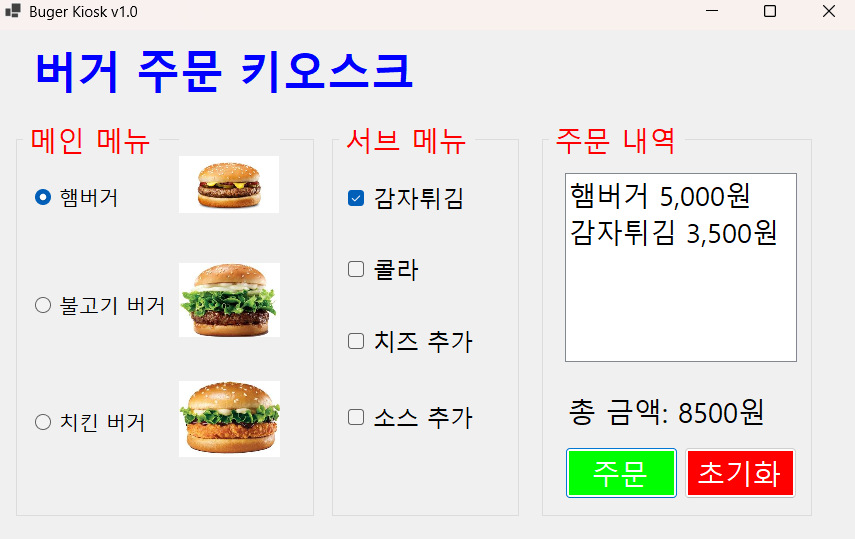
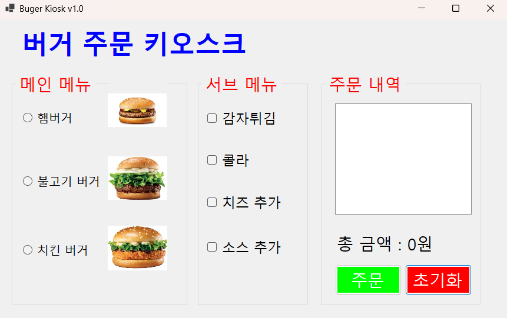
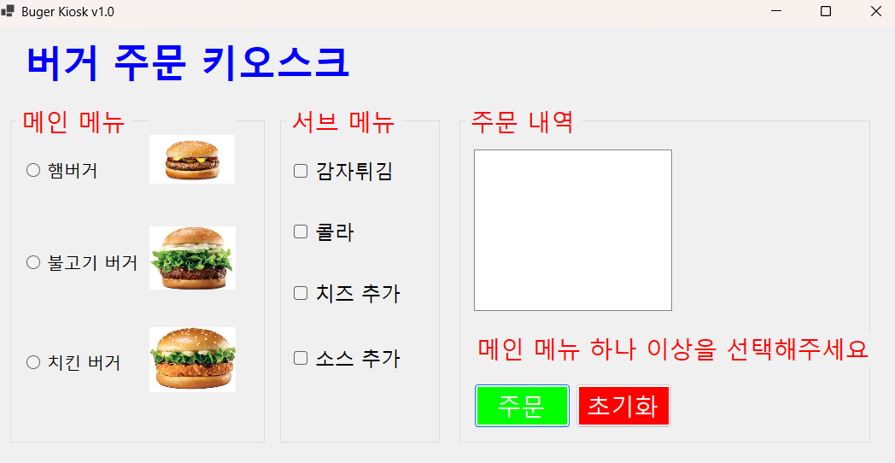
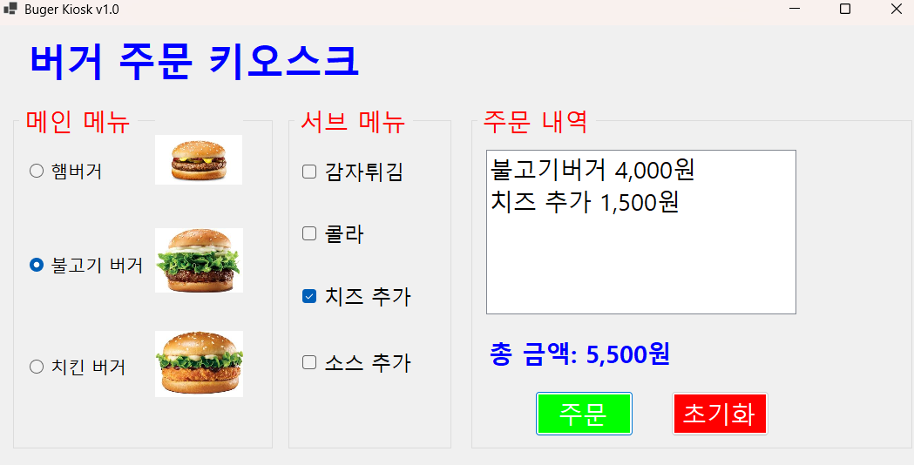
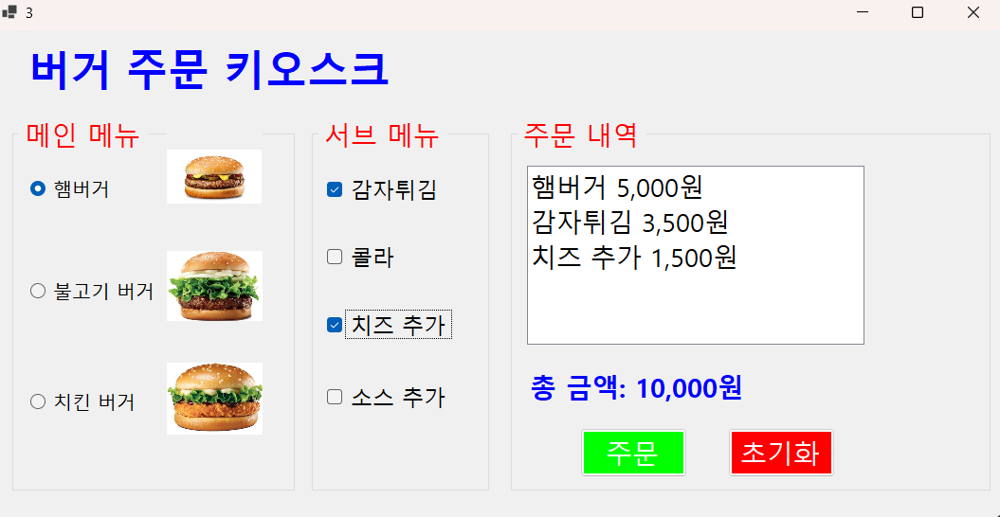
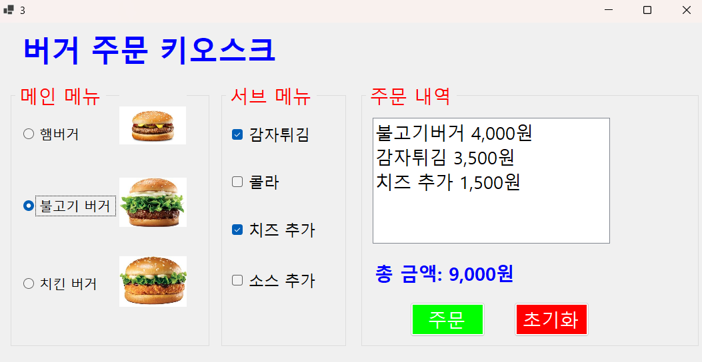

# (C# 코딩) 버거 주문 키오스크
## 개요
- C# 프로그래밍 학습
- 핵심기능: 키오스크에서 버거 메뉴를 선택하여 주문하는 프로그램
- 화면구성: textbox, listbox, button, radiobutton, checkbox, groupbox, picturebox, label
## 실행 화면
- 1단계 코드의 실행 스크린샷

- 2단계 코드의 실행 스크린샷
 

- 3단계 코드의 실행 스크린샷

## 배운 내용
- 라디오 버튼을 사용하여 메뉴 선택 기능 구현
- 선택한 메뉴에 따라 주문 내역을 ListBox에 추가하는 기능 구현
# (C# 코딩) 에코 메신저
## 개요
- C# 프로그래밍 학습
- 1줄 소개: 사용자가 클릭한 메뉴에 따라 주문 내역이 ListBox에 추가되는 버거 주문 키오스크 프로그램
- 사용한 플랫폼:
- C#, .NET Windows Forms, Visual Studio, GitHub
- 사용한 컨트롤: Copileot
- Label, TextBox, ListBox, Button, RadioButton, CheckBox, GroupBox, PictureBox
- 사용한 기술과 구현한 기능:
- Visual Studio를 이용하여 UI 디자인

## 실행 화면
- 코드의 실행 스크린샷과 구현 내용 설명
- 

- 구현한 내용 (위 그림 참조)
- UI 구성 : (이미지 대체)

## 실행 화면
코드의 실행 스크린샷과 구현 내용 설명

- 구현한 내용 (위 그림 참조)
- 디버깅 시 기존에 햄버거에 기본으로 잡히던 포커스를 제거하여 라디오 버튼이 선택되지 않은 상태로 시작하도록 수정

- 총 금액의 가독성 수정

## 실행 화면
코드의 실행 스크린샷과 구현 내용 설명

- 구현한 내용 (위 그림 참조)
- 키보드로만 주문이 가능하게 구현
- Tab을 누르면 그룹박스를 이동하도록 설정하고 방향키로 그룹박스 내에서 포커스를 잡게 이동하도록 설정하며 스페이스바를 눌러 선택 할 수 있게 구현

## 실행 화면
코드의 실행 스크린샷과 구현 내용 설명

- 구현한 내용 (위 그림 참조)
- 선택한 주문 내역이 ListBox에 추가되고 총 금액이 업데이트 되는 기능 구현